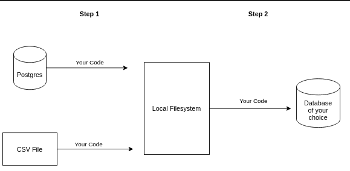
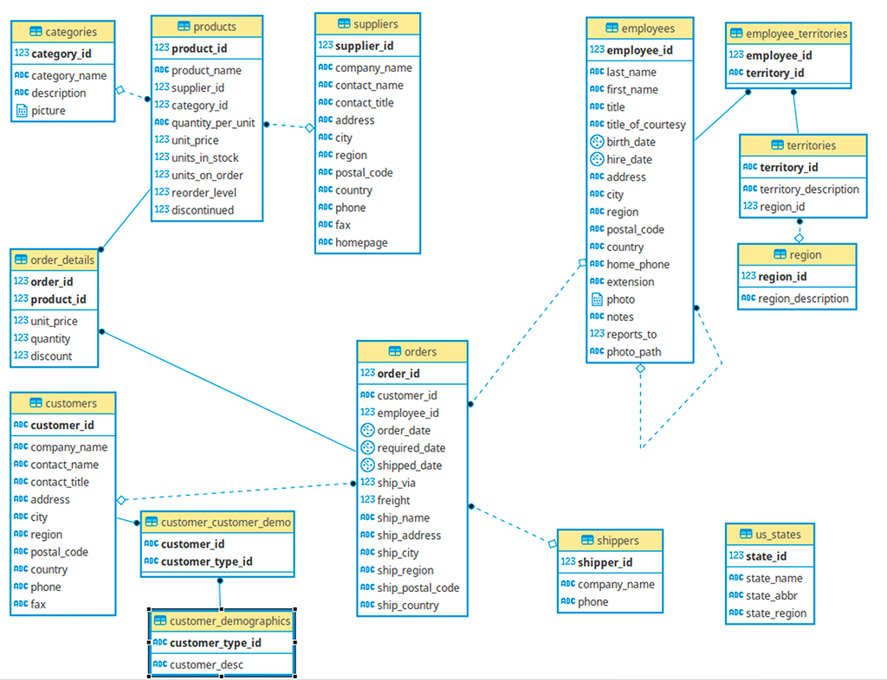
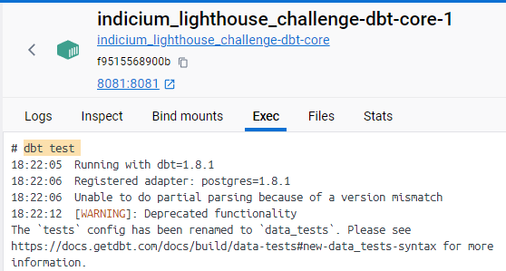

## DBT-Core
Best Practices of DBT-Core: <a href="https://docs.getdbt.com/best-practices/how-we-structure/2-staging">documentação</a>

## Resumo do Desafio
<p align="justify">
Baseado em um desafio, para concorrer uma vaga de emprego como Engenheiro de Dados. Resolvi realizar esse projeto e desenvolver em DBT-Core. </p>

<p align="justify">
Foram fornecidos duas fontes de dados, um database Postgres e um arquivo CSV. E o objetivo desse desafio era construir um pipeline que extrai os dados das bases todos os dias, para futura utilização em Dashboards. </p>

### Ideia de pipeline 


### ERD (Entity Relationship Diagram)


## Dockerfile
O último comando do Dockerfile, mantém o container do DBT-Core ativo, podendo utilizar o terminal "Exec" através do Docker Desktop. Ou acessar o bash do container utilizando o comando abaixo.



``` Dockerfile: 
CMD tail -f /dev/null
```

Para entrar dentro do bash do Container: 
``` bash: 
docker exec -it <container_id> bash 
```
## Rodando a aplicação 
1) Fazer clone do repositorio; 
2) No seu bash executar os comandos: 
``` bash: 
docker-compose build
docker-compose up -d
```
3) Dentro do terminal do DBT-Core, executar os comandos:
- Verificar se está tudo certo com o clone do repositorio:
``` bash: 
dbt debug
```

4) Rodar os comandos para criação de tabelas e views no Postgres
``` bash: 
dbt seed
dbt run
```
5) Caso queira testar alguma coisa, incluindo os "data tests": 
``` bash: 
dbt test
```

### Estrutura do projeto
```
├── models
│   ├── staging
|   |   ├── __sources.yml
│   │   ├── stg_categories.sql
|   |   ├── stg_categories.yml
│   │   ├── stg_customers.sql
│   │   ├── stg_customers.yml
│   │   ├── stg_employee_territories.sql
│   │   ├── stg_employee_territories.yml
│   │   ├── stg_employees.sql
│   │   ├── stg_employees.yml
│   │   ├── stg_order_details.sql
│   │   ├── stg_order_details.yml
│   │   ├── stg_orders.sql
│   │   ├── stg_orders.yml
│   │   ├── stg_products.sql
│   │   ├── stg_products.yml
│   │   ├── stg_region.sql
│   │   ├── stg_region.yml
│   │   ├── stg_shippers.sql
│   │   ├── stg_shippers.yml
│   │   ├── stg_suppliers.sql
│   │   ├── stg_suppliers.yml
│   │   ├── stg_territories.sql
│   │   ├── stg_territories.yml
│   │   ├── stg_us_states.sql
│   │   └── stg_us_states.yml
|   ├── marts
|   |   ├── delivery.sql
│   │   ├── delivery.yml
|   |   ├── qtd_categories_country.sql
│   │   └── qtd_categories_country.yml
```

### Observações sobre próximos passos
<p align="justify">Caso deseje é possível gerar Snapshots, criando um SCD2 (Slow Change Dimension do tipo 2). Além disso, também é possível realizar o Deploy do projeto utilizando Render, AWS ou qualquer outra nuvem.</p>

Para maiores informações sobre como estruturar projetos no DBT-Core. 
1) Best Practices of DBT-Core: <a href="https://docs.getdbt.com/best-practices/how-we-structure/2-staging">documentação</a>
2) Github do Workshop de DBT: <a href="https://github.com/Lucas-Sobreira/meu_data_engineering_roadmap/tree/main/workshops/workshop_DBT">github</a>
3) Aulas do Luciano Galvão sobre os temas: <a href="https://jornadadedados.alpaclass.com/c/cursos/YbsKtM">workshop_DBT_Core</a>

## Desafios pessoais enfrentados e superados durante o projeto
1) <p align="justify">O primeiro desafio, foi a construção do Docker-Compose com as ferramentas Postgres e Pgadmin. Já com a inicialização do projeto, utilizando o arquivo "initial/northwind.sql";</p>

```
volumes:
      - ./initial/northwind.sql:/docker-entrypoint-initdb.d/northwind.sql
```

2) <p align="justify">Depois disso, testado, adicionei a imagem do DBT-Core e fiz as configurações para que conversasse com o Postgres local. Realizando o teste de conexão, criando a tabela "order_details", utilizando o arquivo .CSV contido na pasta Seed, através do arquivo Dockerfile.yml; </p>

``` bash: 
dbt debug

dbt seed
```

3) <p align="justify">Como quis dividir em três schemas diferentes, para fins de organização e criar um DW com camadas medalhão. Tive que alterar o código .sql para que o nome do Schema padrão "public" fosse renomeado para "raw" e assim conseguir finalizar a primeira camada. Tendo criado a maioria das tabelas utilizando o arquivo .sql e complementando as tabelas com uma a mais vindo do arquivo .csv;</p>

``` sql: 
ALTER SCHEMA public RENAME TO raw
```

4) <p align="justify">Para baixar os packages necessários e utilizados durante o projeto, foi criado um arquivo "packages.yml" especificando qual pacote gostaria de instalar e na sequência rodar o comando DBT; </p>

Documentação a respeito dos DBT packages: <a href="https://docs.getdbt.com/docs/build/packages">link_referencia</a>
```bash: 
dbt deps
```